# SyndicateBrain (SIH26189) — Master Entity Roster & Syndicate Directory

> **OFFLINE CRIMINAL INVESTIGATION WORKBENCH — HARYANA POLICE STF & CRIME BRANCH**  
> **Operational Scope:** `Case_01_Sonipat_Arms` (Sonipat Arms & Extortion Syndicate) and `Case_02_Rohtak_Hijack` (Rohtak Highway Consignment Hijack).  
> **Compilation Authority:** Special Task Force (STF) Sonipat / Rohtak Range Investigation Cell.  
> **Classification:** Internal Law Enforcement Working Document.  
> **Reference Standards:** Note frontmatter adheres to `docs/CASE_MODEL.md §4`; evidentiary signals conform to `data/GROUND_TRUTH.md`.

---

## 1. Executive Summary & Roster Overview

This document serves as the single source of truth for all entities, cross-case linkages, identifier maps, and syndicate structures across Haryana Police STF operations in Sonipat, Rohtak, and Panipat, with cross-border intelligence feeds from Punjab.

### Dataset Metric Summary

| Category | Target Metric | Verified Count in Roster | Distribution & Notes |
| :--- | :--- | :--- | :--- |
| **Gangs / Syndicates** | 3 distinct gangs | **3 syndicates + 1 bridge** | 1. Sonipat Arms & Extortion Syndicate<br>2. Punjab Cross-Border Weapons Pipeline<br>3. Rohtak Highway Hijack / Extortion Cell |
| **Monitored Persons** | ~40 people | **44 individuals** | 26 Accused, 6 Police Officers, 6 Complainants / Victims, 6 Witnesses (includes 4 name-disambiguation pairs) |
| **Identifiers** | ~60 identifiers | **66 registered identifiers** | 38 MSISDNs, 11 Handset IMEIs, 6 IMSIs, 10 Vehicle Registrations, 4 Financial VPAs / Accounts |
| **Police Jurisdictions** | Key Haryana/Punjab thanas | **11 Police Stations** | PS Kharkhoda, PS Sonipat Sadar, PS Rai, PS Murthal, PS Kundli, PS Gohana, PS Ganaur, PS Rohtak Urban, PS Sampla, PS Panipat City, PS Ferozepur Cantt |
| **Cell Tower Sites** | Core corridor towers | **9 Base Transceiver Stations** | HR-SNP-0147 (Toll Plaza), HR-SNP-0089 (Kharkhoda), HR-SNP-0211 (Murthal), HR-ROH-0052, HR-PAN-0033, etc. |
| **Cross-Case Overlap** | Deterministic hits | **2 shared identifiers** | MSISDN `9896011223` (Rehan Khan) & IMEI `869123456789012` (OnePlus Nord CE) |

---

## 2. Table of Persons (`01_People/`)

This directory catalogs all persons appearing in formal case records (FIRs, witness depositions, statement transcripts, and CDR analysis). Per `docs/CASE_MODEL.md §3`, persons are categorized by legal procedural role (`accused`, `witness`, `complainant`, `victim`, `officer`), not arbitrary police labels.

| Person ID | Canonical Name | Aliases & Devanagari Surface | Role | Syndicate / Affiliation | Primary Identifiers | Associated Thana | Operational Profile / Evidentiary Context |
| :--- | :--- | :--- | :--- | :--- | :--- | :--- | :--- |
| `person_0001` | **SI Rajesh Kumar** | Sub-Inspector Rajesh Kumar / एसआई राजेश कुमार | `officer` | Haryana Police (PS Kharkhoda) | `9812555001` (CUG) | PS Kharkhoda | Investigating Officer / Complainant in FIR 0142/2026; led naka interception on Kharkhoda bypass. |
| `person_0002` | **Inspector Ramphal** | Insp. Ramphal Singh / निरीक्षक रामफल | `officer` | Haryana Police (PS Sonipat Sadar) | `9812555002` (CUG) | PS Sonipat Sadar | Investigating Officer; recorded Section 180 BNSS statement of accused Amit Malik on 17/02/2026. |
| `person_0003` | **Inspector Jaideep Hooda** | SHO Jaideep Hooda / निरीक्षक जयदीप हुड्डा | `officer` | Haryana Police (PS Rohtak Urban) | `9812555003` (CUG) | PS Rohtak Urban | Lead investigator in FIR 0089/2026 (Rohtak Highway Consignment Hijack); initiated cross-case trace. |
| `person_0004` | **DSP Virender Rao** | DSP Virender Rao / डीएसपी वीरेंद्र राव | `officer` | Haryana Police (STF Sonipat Unit) | `9812555004` (CUG) | STF Sonipat | Supervisory Officer overseeing inter-district organized crime syndicates across Sonipat and Rohtak. |
| `person_0005` | **EHC Sandeep** | EHC Sandeep No. 412 / ईएचसी संदीप | `officer` | Haryana Police (PS Kharkhoda) | `9812555005` (CUG) | PS Kharkhoda | Member of night patrolling naka party involved in vehicle interception and weapons seizure. |
| `person_0006` | **CT Manoj** | Constable Manoj No. 892 / सिपाही मनोज | `officer` | Haryana Police (PS Kharkhoda) | `9812555006` (CUG) | PS Kharkhoda | Member of police naka detachment; escort and seizure witness under FIR 0142/2026. |
| `person_0007` | **Naresh Bansal** | Naresh Bansal / नरेश बंसल | `complainant` | Civilian (Trader / Agro Mill Owner) | `9812666001`, `HR-10-Q-1289` | PS Rai | Owner of Bansal Agro Processing, Rai Industrial Area; target of repeated ₹50 lakh extortion demands. |
| `person_0008` | **Satish Grover** | Satish Grover / सतीश ग्रोवर | `victim` | Civilian (Auto Parts Dealer) | `9812666002` | PS Kharkhoda | Proprietor of Grover Spares Kharkhoda; received threatening extortion calls and warning shots at shopfront. |
| `person_0009` | **Kuldeep Sharma** | Kuldeep Sharma / कुलदीप शर्मा | `complainant` | SecureTrans Logistics (Employee) | `9812666003` | PS Rohtak Urban | Driver of hijacked cash & bullion transit van HR-14-E-5544; complainant in FIR 0089/2026 Rohtak. |
| `person_0010` | **Rakesh Mittal** | Rakesh Mittal / राकेश मित्तल | `victim` | SecureTrans Logistics (Branch Manager) | `9812666004` | PS Rohtak Urban | Custodian and branch manager at Rohtak depot; hostage during highway intercept at Sampla cut. |
| `person_0011` | **Mohit Agarwal** | Mohit Agarwal / मोहित अग्रवाल | `complainant` | Civilian (Textile Exporter) | `9812666005` | PS Panipat City | Panipat industrialist; lodged extortion complaint regarding threats received from cross-district burner lines. |
| `person_0012` | **Gurpreet Sandhu** | Gurpreet "Guri" Sandhu / गुरप्रीत सिंह संधू उर्फ गुरी | `accused` | Punjab Cross-Border Weapons Pipeline | `9812987654`, `869123456789012` | PS Ferozepur Cantt | Operates border smuggling conduit out of Ferozepur; uses rotating handset `869123456789012` (08/02–14/02). |
| `person_0013` | **Harpreet Cheema** | Harpreet Cheema @ Happy / हरप्रीत चीमा उर्फ हैप्पी | `accused` | Punjab Cross-Border Weapons Pipeline | `9812088776`, `864567213045004` | PS Ferozepur Cantt | Cross-border retrieval operative; coordinates drops along Fazilka/Ferozepur agricultural fence. |
| `person_0014` | **Jaspal Singh** | Jaspal Singh @ Jassa / जसपाल सिंह उर्फ जस्सा | `accused` | Punjab Cross-Border Weapons Pipeline | `9876111201`, `868901657489008` | PS Tarn Taran | Country-made weapons modification specialist; procures ammunition and barrel components in Majha. |
| `person_0015` | **Davinder Gill** | Davinder Gill @ Dev / दविंदर गिल उर्फ देव | `accused` | Punjab Cross-Border Weapons Pipeline | `9876111202`, `DL-1C-AA-9081` | PS Panipat City | Hawala handler and financial conduit; channels extortion payouts from Haryana into Punjab networks. |
| `person_0016` | **Amandeep Singh** | Amandeep Singh @ Aman / अमनदीप सिंह | `accused` | Punjab Cross-Border Weapons Pipeline | `9876111203`, `PB-02-CX-4102` | PS Rai | Heavy transport driver; moves concealed munitions within agricultural consignment trucks into Sonipat. |
| `person_0017` | **Harjinder Singh** | Harjinder Singh @ Laddi / हरजिंदर सिंह लाड्डी | `accused` | Punjab Cross-Border Weapons Pipeline | `9876111205` | PS Ferozepur Cantt | Depot caretaker in rural Ferozepur; provides transit safe storage for consignments heading south. |
| `person_0018` | **Jagtar Singh** | Jagtar Singh / जगतार सिंह | `accused` | Punjab Cross-Border Weapons Pipeline | `9876111206` | PS Tarn Taran | Procurement liaison for illegal ordnance; handles inter-gang weapon handoffs in border belt. |
| `person_0019` | **Balwinder Singh Dhillon** | Balwinder Dhillon / बलविंदर सिंह ढिल्लों | `accused` | Punjab Cross-Border Weapons Pipeline | `9876111204` | PS Tarn Taran | Amritsar rural arms coordinator; **Distinct entity from Balwinder Singh (`person_0035`) of Rohtak**. |
| `person_0021` | **Suresh Goel** | Suresh Goel / सुरेश गोयल | `accused` | Rohtak Highway Hijack / Extortion Cell | `9812233445`, `863456102934003`, `HR-12-C-8890` | PS Rohtak Urban | Cell leader in FIR 0089/2026; contacted Rehan Khan (`9896011223`) on 13/02 preceding consignment ambush. |
| `person_0022` | **Rakesh @ Kalu Rohtak** | Rakesh Kumar @ Kalu / राकेश उर्फ कालू रोहतक | `accused` | Rohtak Highway Hijack / Extortion Cell | `9812444301`, `869012768590009` | PS Rohtak Urban | Armed interceptor; brandished automatic weapon during forced stop of cash transit vehicle. |
| `person_0023` | **Vikas Rathi** | Vikas Rathi / विकास राठी | `accused` | Rohtak Highway Hijack / Extortion Cell | `9812444302` | PS Sampla | Getaway driver; mapped bypass routes and police naka movements along NH-9 Rohtak-Delhi stretch. |
| `person_0024` | **Sonu @ Sonu Sampla** | Sonu @ Sonu Sampla / सोनू उर्फ सोनू सांपला | `accused` | Rohtak Highway Hijack / Extortion Cell | `9812444303` | PS Sampla | Highway scout / spotter; relayed departure times of target consignment from Rohtak industrial hub. |
| `person_0025` | **Deepak Hooda** | Deepak Hooda / दीपक हुड्डा | `accused` | Rohtak Highway Hijack / Extortion Cell | `9812444304` | PS Rohtak City | Stolen consignment fence; arranged stash warehouse on outskirts of Rohtak for hijacked merchandise. |
| `person_0026` | **Ajay Dalal** | Ajay Dalal / अजय दलाल | `accused` | Rohtak Highway Hijack / Extortion Cell | `9812444305` | PS Rohtak Urban | Armed participant; provided armed intimidation during transit vehicle hijack on NH-9. |
| `person_0027` | **Jagdish Chander** | Jagdish Chander / जगदीश चंदर | `witness` | Civilian (Dhaba Proprietor) | `9812777001` | PS Murthal | Proprietor of Highway King Dhaba, Murthal; witnessed parking-lot meeting and package handoff on 07/02/2026. |
| `person_0028` | **Sunil Verma** | Sunil Verma / सुनील वर्मा | `witness` | Civilian (Banquet Hall Manager) | `9812777002` | PS Panipat City | General Manager, Hotel Grand Plaza, GT Road Panipat; maintains guest register and CCTV logs for 12/02/2026. |
| `person_0029` | **Dharamvir Pehalwan** | Dharamvir Coach / धर्मवीर पहलवान | `witness` | Civilian (Akhada Trainer) | `9812777003` | PS Kharkhoda | Head wrestling coach at Kharkhoda Akhada; identified Rohit Pehalwan and Suresh Shooter as frequent visitors. |
| `person_0030` | **Paramjit Kaur** | Paramjit Kaur / परमजीत कौर | `witness` | Civilian (Property Owner) | `9812777004` | PS Kundli | Landlady of commercial godown in Kundli Industrial Area rented out by Rehan Khan under assumed name. |
| `person_0031` | **Vikram Singh** | Vikram Singh @ Vicky Kharkhoda / विक्रम सिंह उर्फ विक्की / V. Singh | `accused` | Sonipat Arms & Extortion Syndicate | `9812345678`, `869123456789012` | PS Kharkhoda | **Syndicate Kingpin (Proxy)**; structurally central bottleneck (#1 betweenness); talks only to lieutenants. |
| `person_0032` | **Suresh Shooter** | Suresh Kumar @ Suresh Shooter / सुरेश कुमार उर्फ शूटर | `accused` | Sonipat Arms & Extortion Syndicate | `9812011234`, `862345091823002`, `HR-10-X-7711` | PS Kharkhoda | Primary hitman / field shooter; carried out firing outside Satish Grover's shop; received call from Amit Malik. |
| `person_0033` | **Rohit Pehalwan** | Rohit Dahiya @ Rohit Pehalwan / रोहित दहिया उर्फ पहलवान | `accused` | Sonipat Arms & Extortion Syndicate | `9812900011`, `865678324156005` | PS Kharkhoda | Muscle and field enforcer; coordinates physical extortion collection; pillion rider on Pulsar HR-10-X-7711. |
| `person_0034` | **Sandeep Kala** | Sandeep @ Sandeep Kala / संदीप उर्फ काला | `accused` | Sonipat Arms & Extortion Syndicate | `9812700022`, `867890546378007`, `HR-11-D-3321` | PS Sonipat Sadar | Transport courier and scout; pilot vehicle driver for arms convoys moving along Rohtak-Sonipat corridor. |
| `person_0035` | **Balwinder Singh** | Balwinder Singh / बलविंदर सिंह (रोहतक) | `accused` | Sonipat Arms & Extortion Syndicate | `9812155443`, `867812034912001` | PS Rohtak Urban | Senior lieutenant to Vikram Singh; weapons procurement & inter-district liaison; named in FIR 0142/2026. |
| `person_0036` | **Kuldeep @ KD** | Kuldeep Singh @ KD / कुलदीप उर्फ केडी | `accused` | Sonipat Arms & Extortion Syndicate | `9812888101`, `866789435267006` | PS Rai | High-volume extortion caller; initiates 200+ intimidation calls across Sonipat/Panipat (peripheral noise). |
| `person_0037` | **Jaideep Malik** | Jaideep Malik / जयदीप मलिक | `accused` | Sonipat Arms & Extortion Syndicate | `9812888102` | PS Sonipat Sadar | Field reconnaissance operative; surveilled factory premises of Naresh Bansal in Rai Industrial Area. |
| `person_0038` | **Naveen Boxer** | Naveen Kumar @ Naveen Boxer / नवीन कुमार उर्फ बॉक्सर | `accused` | Sonipat Arms & Extortion Syndicate | `9812888103` | PS Gohana | Muscle operative; provides physical intimidation during property dispute extortions in Gohana/Sonipat. |
| `person_0039` | **Amit Malik** | Amit Malik / अमित मलिक | `accused` | Sonipat Arms & Extortion Syndicate | `9812099881`, `865432098765432`, `HR-10-AB-4412` | PS Sonipat Sadar | Enforcer; claims false Panipat wedding alibi on 12/02/2026; pinged at Sonipat Toll Plaza (`HR-SNP-0147`). |
| `person_0040` | **Manjeet Hooda** | Manjeet Hooda / मंजीत हुड्डा | `accused` | Sonipat Arms & Extortion Syndicate | `9812888104` | PS Gohana | Weapons depot custodian; maintained underground arms stash at farm premises outside Gohana. |
| `person_0041` | **Rajbir Singh** | Rajbir Singh @ Munna / राजबीर सिंह उर्फ मुन्ना | `accused` | Sonipat Arms & Extortion Syndicate | `9812888105`, `HR-79-A-9901` | PS Kharkhoda | Telecom agent / identity forger; supplied fake SIM cards and forged KYC papers to syndicate members. |
| `person_0042` | **Rehan Khan** | Rehan Khan / रेहान खान | `accused` | Sonipat Arms Syndicate / Rohtak Hijack Cell | `9896011223`, `861234059123456`, `HR-26-AB-1234` | PS Kharkhoda / PS Rohtak Urban | **Inter-Gang Bridge & Logistics Handler**; apprehended with Vikram Singh; cross-case link in Rohtak Hijack. |
| `person_0043` | **Vikram Singh Yadav** | Vikram Singh Yadav / विक्रम सिंह यादव | `witness` | Civilian (Scrap Merchant) | `9812999001` | PS Rai | Businessman in Rai; **Name disambiguation control** (unrelated civilian sharing name with Vikram Singh). |
| `person_0044` | **Amit Kumar** | Amit Kumar / अमित कुमार | `witness` | Civilian (Mobile Accessories Shop) | `9812999002` | PS Kharkhoda | Shopkeeper at Kharkhoda bus stand; **Name disambiguation control** (unrelated to Amit Malik). |
| `person_0045` | **Amit Dahiya** | Amit Dahiya / अमित दहिया | `witness` | Civilian (Groom / Panipat Host) | `9812999005` | PS Panipat City | Bridegroom at Hotel Grand Plaza Panipat wedding on 12/02/2026; statement refutes Amit Malik's presence. |
| `person_0046` | **Suresh Chand** | Suresh Chand / सुरेश चंद | `witness` | Civilian (Grain Commission Agent) | `9812999003` | PS Panipat City | Panipat Mandi merchant; **Name disambiguation control** (unrelated to Suresh Shooter or Suresh Goel). |
| `person_0047` | **Rohit Kumar** | Rohit Kumar / रोहित कुमार | `witness` | Civilian (Toll Plaza Operator) | `9812999004` | PS Sonipat Sadar | On-duty toll booth operator at Sonipat Toll Plaza (NH-44) on 12/02/2026 21:00–22:00. |
| `person_0048` | **Rajesh Sharma** | Rajesh Sharma / राजेश शर्मा | `victim` | Civilian (Fleet Owner) | `9812999006` | PS Rohtak Urban | Transporter in Rohtak whose transit vehicles were extorted by Suresh Goel's gang. |

---

## 3. Table of Identifiers (`02_Identifiers/`)

All investigative linking keys (MSISDNs, IMEIs, IMSIs, Vehicle Registrations, Financial VPAs/Accounts, Police Thanas, and BTS Towers). In SyndicateBrain, links are indexed centrally under `02_Identifiers/` to facilitate cross-case queries.

| Identifier Value | Identifier Type | Registered / Assigned Entity | Associated Syndicate / Context | Evidentiary Source & Operational Significance |
| :--- | :--- | :--- | :--- | :--- |
| `9812345678` | `phone` | Vikram Singh (`person_0031`) | Sonipat Arms Syndicate | Kingpin line; forged KYC; 14 calls across 72h exclusively to Rehan Khan; low CDR volume (~15th rank). |
| `9896011223` | `phone` | Rehan Khan (`person_0042`) | Sonipat Arms / Rohtak Hijack | **Deterministic Cross-Case Link**; bridge between Vikram Singh, Balwinder Singh, and Suresh Goel. |
| `9812155443` | `phone` | Balwinder Singh (`person_0035`) | Sonipat Arms Syndicate | Weapons procurement line; contacted by Rehan Khan (`9896011223`) on 12/02 22:45:10. |
| `9812099881` | `phone` | Amit Malik (`person_0039`) | Sonipat Arms Syndicate | Enforcer phone; latches cell `HR-SNP-0147` at 21:18:30 on 12/02/2026, refuting Panipat wedding alibi. |
| `9812987654` | `phone` | Gurpreet Sandhu (`person_0012`) | Punjab Cross-Border Pipeline | Punjab pipeline conduit; activated inside burner IMEI `869123456789012` on 08/02/2026. |
| `9812011234` | `phone` | Suresh Shooter (`person_0032`) | Sonipat Arms Syndicate | Hitman line; received incoming call from Amit Malik (`9812099881`) on 12/02 21:18:30 during transit. |
| `9812233445` | `phone` | Suresh Goel (`person_0021`) | Rohtak Highway Hijack Cell | Rohtak hijack leader; placed 3 pre-operation coordination calls to Rehan Khan (`9896011223`) on 13/02. |
| `9812088776` | `phone` | Harpreet Cheema (`person_0013`) | Punjab Cross-Border Pipeline | Ferozepur border phone; called by Gurpreet Sandhu on 13/02 11:30:15 regarding arms shipment. |
| `9812900011` | `phone` | Rohit Pehalwan (`person_0033`) | Sonipat Arms Syndicate | Recovery muscle line; called by Amit Malik on 14/02 09:10:00 prior to planned extortion pickup. |
| `9812700022` | `phone` | Sandeep Kala (`person_0034`) | Sonipat Arms Syndicate | Scout / pilot driver line; exchanged calls with Rehan Khan on 14/02 12:40:18 near Kharkhoda bypass. |
| `9812888101` | `phone` | Kuldeep @ KD (`person_0036`) | Sonipat Arms Syndicate | High-volume extortion phone (>200 outbound calls); primary source of CDR noise masking core syndicate. |
| `9812888102` | `phone` | Jaideep Malik (`person_0037`) | Sonipat Arms Syndicate | Field scout phone; logged pings around Rai Industrial Area during surveillance runs. |
| `9812888103` | `phone` | Naveen Boxer (`person_0038`) | Sonipat Arms Syndicate | Enforcer phone; active in Gohana/Sonipat sectors. |
| `9812888104` | `phone` | Manjeet Hooda (`person_0040`) | Sonipat Arms Syndicate | Arms warehouse contact phone; low call volume; latched to Gohana cell towers. |
| `9812888105` | `phone` | Rajbir Singh (`person_0041`) | Sonipat Arms Syndicate | Forged SIM broker phone; linked to bulk activation of prepaid Airtel numbers. |
| `9876111201` | `phone` | Jaspal Singh (`person_0014`) | Punjab Cross-Border Pipeline | Majha armorer contact; connects to Gurpreet Sandhu for ordnance deliveries. |
| `9876111202` | `phone` | Davinder Gill (`person_0015`) | Punjab Cross-Border Pipeline | Hawala financial link; coordinates money transfers between Sonipat extortion cash and Punjab buyers. |
| `9876111203` | `phone` | Amandeep Singh (`person_0016`) | Punjab Cross-Border Pipeline | Truck driver phone; logs cell hops along NH-44 corridor from Ludhiana to Murthal. |
| `9876111204` | `phone` | Balwinder Dhillon (`person_0019`) | Punjab Cross-Border Pipeline | Amritsar rural coordinator; distinct MSISDN preventing false merge with Rohtak Balwinder. |
| `9876111205` | `phone` | Harjinder Singh (`person_0017`) | Punjab Cross-Border Pipeline | Fazilka border storage line. |
| `9876111206` | `phone` | Jagtar Singh (`person_0018`) | Punjab Cross-Border Pipeline | Border courier contact line. |
| `9812444301` | `phone` | Rakesh @ Kalu (`person_0022`) | Rohtak Highway Hijack Cell | Armed interceptor phone; active in Rohtak Sampla corridor on 13/02–14/02. |
| `9812444302` | `phone` | Vikas Rathi (`person_0023`) | Rohtak Highway Hijack Cell | Getaway driver line; short coordination bursts with Suresh Goel. |
| `9812444303` | `phone` | Sonu @ Sonu Sampla (`person_0024`) | Rohtak Highway Hijack Cell | Highway spotter phone; stationed near NH-9 junction. |
| `9812444304` | `phone` | Deepak Hooda (`person_0025`) | Rohtak Highway Hijack Cell | Warehouse receiver phone in Rohtak. |
| `9812444305` | `phone` | Ajay Dalal (`person_0026`) | Rohtak Highway Hijack Cell | Hijack team tactical comms line. |
| `9812555001` | `phone` | SI Rajesh Kumar (`person_0001`) | Police CUG / Official | Official Closed User Group phone; PS Kharkhoda. |
| `9812555002` | `phone` | Inspector Ramphal (`person_0002`) | Police CUG / Official | Official Closed User Group phone; PS Sonipat Sadar. |
| `9812555003` | `phone` | Insp. Jaideep Hooda (`person_0003`) | Police CUG / Official | Official Closed User Group phone; PS Rohtak Urban. |
| `9812555004` | `phone` | DSP Virender Rao (`person_0004`) | Police CUG / Official | Official Closed User Group phone; STF Sonipat. |
| `9812555005` | `phone` | EHC Sandeep (`person_0005`) | Police CUG / Official | Station official wireless dispatch; PS Kharkhoda. |
| `9812555006` | `phone` | CT Manoj (`person_0006`) | Police CUG / Official | Station official wireless dispatch; PS Kharkhoda. |
| `9812666001` | `phone` | Naresh Bansal (`person_0007`) | Victim / Complainant | Factory landline and personal mobile; received extortion threats. |
| `9812666002` | `phone` | Satish Grover (`person_0008`) | Victim / Complainant | Shop commercial phone; targeted by Suresh Shooter. |
| `9812666003` | `phone` | Kuldeep Sharma (`person_0009`) | Complainant / Victim | Driver phone; SecureTrans transit van. |
| `9812666004` | `phone` | Rakesh Mittal (`person_0010`) | Victim | Branch manager mobile; SecureTrans Rohtak. |
| `9812666005` | `phone` | Mohit Agarwal (`person_0011`) | Complainant | Panipat mill business line; target of cross-border extortion call. |
| `9812777001` | `phone` | Jagdish Chander (`person_0027`) | Witness / Civilian | Dhaba commercial billing counter phone; Murthal. |
| `9812777002` | `phone` | Sunil Verma (`person_0028`) | Witness / Civilian | Hotel Grand Plaza Panipat banquet office phone. |
| `9812777003` | `phone` | Dharamvir Coach (`person_0029`) | Witness / Civilian | Akhada contact line; Kharkhoda. |
| `9812777004` | `phone` | Paramjit Kaur (`person_0030`) | Witness / Civilian | Kundli godown rental contact line. |
| `9812999001` | `phone` | Vikram Singh Yadav (`person_0043`)| Civilian Control | Business phone; scrap dealer in Rai (Disambiguation). |
| `9812999002` | `phone` | Amit Kumar (`person_0044`) | Civilian Control | Recharge shop phone; Kharkhoda (Disambiguation). |
| `9812999003` | `phone` | Suresh Chand (`person_0046`) | Civilian Control | Commission agent phone; Panipat Mandi (Disambiguation). |
| `9812999004` | `phone` | Rohit Kumar (`person_0047`) | Witness / Civilian | Personal phone; toll collector at Sonipat Toll Plaza. |
| `9812999005` | `phone` | Amit Dahiya (`person_0045`) | Witness / Civilian | Groom phone; Panipat wedding 12/02/2026. |
| `9812999006` | `phone` | Rajesh Sharma (`person_0048`) | Victim / Civilian | Fleet dispatch phone; Rohtak (Disambiguation from SI Rajesh). |
| `869123456789012` | `imei` | Vikram Singh / Gurpreet Sandhu | Inter-Gang Handset Bridge | **Shared Burner Handset (Black OnePlus Nord CE)**; swapped at Murthal on 07/02; zero direct calls. |
| `861234059123456` | `imei` | Rehan Khan (`person_0042`) | Sonipat Arms / Rohtak Hijack | Samsung Galaxy M34 handset; seized in FIR 0142/2026; active across Sonipat and Rohtak incidents. |
| `865432098765432` | `imei` | Amit Malik (`person_0039`) | Sonipat Arms Syndicate | Realme Narzo 50 handset; registered on tower `HR-SNP-0147` at 21:18:30 on 12/02/2026. |
| `867812034912001` | `imei` | Balwinder Singh (`person_0035`) | Sonipat Arms Syndicate | Vivo Y21 handset; logged in Rohtak cell towers. |
| `862345091823002` | `imei` | Suresh Shooter (`person_0032`) | Sonipat Arms Syndicate | Redmi Note 11 handset; active during shooting incidents in Kharkhoda. |
| `863456102934003` | `imei` | Suresh Goel (`person_0021`) | Rohtak Highway Hijack Cell | Poco M4 Pro handset; logged near Sampla bypass during highway ambush. |
| `864567213045004` | `imei` | Harpreet Cheema (`person_0013`) | Punjab Cross-Border Pipeline | Oppo A57 handset; active in Ferozepur border belt. |
| `865678324156005` | `imei` | Rohit Pehalwan (`person_0033`) | Sonipat Arms Syndicate | Motorola G52 handset; associated with extortion collection runs. |
| `866789435267006` | `imei` | Kuldeep @ KD (`person_0036`) | Sonipat Arms Syndicate | Infinix Hot 12 handset; generates high-volume outgoing extortion traffic. |
| `867890546378007` | `imei` | Sandeep Kala (`person_0034`) | Sonipat Arms Syndicate | Lava Blaze 5G handset; active during convoy escort duties. |
| `868901657489008` | `imei` | Jaspal Singh (`person_0014`) | Punjab Cross-Border Pipeline | Redmi 9A handset; localized to Tarn Taran. |
| `869012768590009` | `imei` | Rakesh @ Kalu (`person_0022`) | Rohtak Highway Hijack Cell | Realme C31 handset; used during armed heist. |
| `404450112233441` | `imsi` | Vikram Singh (`person_0031`) | Sonipat Arms Syndicate | Airtel SIM IMSI active in burner IMEI `869123456789012` from 01/02/2026 to 07/02/2026 19:45:00. |
| `404450998877662` | `imsi` | Gurpreet Sandhu (`person_0012`) | Punjab Cross-Border Pipeline | Airtel SIM IMSI active in burner IMEI `869123456789012` from 08/02/2026 10:15:00 to 14/02/2026. |
| `404450123456789` | `imsi` | Rehan Khan (`person_0042`) | Sonipat Arms / Rohtak Hijack | Airtel SIM IMSI assigned to `9896011223`; logged in Sonipat Toll Plaza cell at 21:14:02. |
| `404450334455667` | `imsi` | Amit Malik (`person_0039`) | Sonipat Arms Syndicate | Airtel SIM IMSI assigned to `9812099881`; logged in Sonipat Toll Plaza cell at 21:18:30. |
| `404450445566778` | `imsi` | Balwinder Singh (`person_0035`) | Sonipat Arms Syndicate | Airtel SIM IMSI assigned to `9812155443`. |
| `404450556677889` | `imsi` | Suresh Shooter (`person_0032`) | Sonipat Arms Syndicate | Airtel SIM IMSI assigned to `9812011234`. |
| `HR-26-AB-1234` | `vehicle_reg` | Rehan Khan / Vikram Singh | Sonipat Arms Syndicate | White Mahindra Scorpio; intercepted at Kharkhoda naka; 4 country-made .32 pistols seized. |
| `HR-10-AB-4412` | `vehicle_reg` | Amit Malik (`person_0039`) | Sonipat Arms Syndicate | Silver Mahindra Bolero; used for enforcer movements along NH-44 corridor. |
| `HR-12-C-8890` | `vehicle_reg` | Suresh Goel (`person_0021`) | Rohtak Highway Hijack Cell | White Maruti Swift; getaway vehicle used during highway hijack in FIR 0089/2026. |
| `HR-14-E-5544` | `vehicle_reg` | SecureTrans Logistics | Victim Vehicle (Rohtak Case) | Armoured cash transit vehicle intercepted and hijacked on NH-9 near Sampla cut. |
| `PB-02-CX-4102` | `vehicle_reg` | Amandeep Singh (`person_0016`) | Punjab Cross-Border Pipeline | Eicher 14-ft Canter truck; concealed compartments used for moving illicit ordnance across state lines. |
| `HR-10-X-7711` | `vehicle_reg` | Suresh Shooter / Rohit Pehalwan | Sonipat Arms Syndicate | Black Bajaj Pulsar 220F motorcycle; used in drive-by extortion firings in Kharkhoda & Sonipat. |
| `HR-11-D-3321` | `vehicle_reg` | Sandeep Kala (`person_0034`) | Sonipat Arms Syndicate | Dark Grey Mahindra Scorpio; pilot vehicle conducting route checks ahead of arms shipments. |
| `DL-1C-AA-9081` | `vehicle_reg` | Davinder Gill (`person_0015`) | Punjab Cross-Border Pipeline | Grey Hyundai Verna; interstate cash/hawala transit vehicle between Ludhiana and Delhi NCR. |
| `HR-79-A-9901` | `vehicle_reg` | Rajbir Singh (`person_0041`) | Sonipat Arms Syndicate | Honda Activa scooter; used for local delivery of fraudulently activated SIM cards in Kharkhoda. |
| `HR-10-Q-1289` | `vehicle_reg` | Naresh Bansal (`person_0007`) | Victim Vehicle | White Toyota Fortuner; tracked by syndicate spotters outside Rai industrial estate. |
| `hawalapunjab@upi` | `account` | Davinder Gill (`person_0015`) | Financial Conduit | UPI Virtual Payment Address used for distributing illegal extortion proceeds. |
| `kd-recovery-snp@okhdfcbank`| `account`| Kuldeep @ KD (`person_0036`) | Sonipat Arms Syndicate | UPI VPA used for collecting coercive extortion deposits from petty traders. |
| `A/C 02341010005432` | `account` | Rajbir Singh (`person_0041`) | Sonipat Arms Syndicate | Punjab National Bank (Kharkhoda Branch); conduit for bulk telecom vendor commission payments. |
| `A/C 50100432987112` | `account` | Naresh Bansal (`person_0007`) | Complainant Account | HDFC Bank (Sector 14 Sonipat); target account from which extortion sum was demanded. |
| `HR-SNP-0147` | `cell_tower` | Sonipat Toll Plaza / Sector 14 | NH-44 Highway Node | Key BTS site; registers Rehan Khan (21:14:02) and Amit Malik (21:18:30) on 12/02/2026. |
| `HR-SNP-0089` | `cell_tower` | Kharkhoda Bypass / Flyover | Sonipat Arterial Node | BTS site covering interception point where Scorpio HR-26-AB-1234 was seized on 14/02/2026. |
| `HR-SNP-0211` | `cell_tower` | Murthal Dhabas / Sector Cut | NH-44 Commercial Node | BTS site covering meeting spot where burner handset `869123456789012` was exchanged on 07/02/2026. |
| `HR-ROH-0052` | `cell_tower` | Rohtak Urban / Old Bus Stand | Rohtak Central Node | BTS site recording pre-hijack coordination calls between Suresh Goel and Rehan Khan. |
| `HR-ROH-0089` | `cell_tower` | Sampla Highway Cut / NH-9 | Rohtak Rural Highway Node | BTS site covering ambush location where SecureTrans cash van was hijacked in FIR 0089/2026. |
| `HR-PAN-0033` | `cell_tower` | Panipat GT Road / Industrial | Panipat Highway Node | BTS site covering Hotel Grand Plaza where Amit Malik claimed to be during the 12/02 incident. |
| `PB-FZP-0012` | `cell_tower` | Ferozepur Cantt Border Post | Punjab Border Node | BTS site recording border transmissions of Gurpreet Sandhu and Harpreet Cheema. |

---

## 4. Syndicate Structures & Operational Roles

```mermaid
graph TD
    subgraph Gang_2 ["Punjab Cross-Border Weapons Pipeline"]
        Guri["Gurpreet 'Guri' Sandhu<br>9812987654<br>(Border Logistics)"]
        Cheema["Harpreet Cheema<br>9812088776<br>(Border Retrieval)"]
        Jassa["Jaspal Singh 'Jassa'<br>(Arms Modder)"]
        Aman["Amandeep Singh<br>(Truck Transit)"]
        Dev["Davinder Gill<br>(Hawala Conduit)"]
        
        Cheema --> Guri
        Jassa --> Guri
        Guri --> Aman
        Guri --> Dev
    end

    subgraph Handset_Bridge ["Deterministic IMEI Bridge (Murthal Handoff 07/02)"]
        BurnerHandset["Black OnePlus Nord CE<br>IMEI: 869123456789012<br>(Zero direct calls between numbers)"]
    end

    subgraph Gang_1 ["Sonipat Arms & Extortion Syndicate"]
        Vikram["Vikram Singh<br>9812345678<br>★ PROXY KINGPIN (#1 Betweenness)"]
        Rehan["Rehan Khan<br>9896011223<br>(Logistics Lieutenant)"]
        Balwinder["Balwinder Singh<br>9812155443<br>(Procurement Lieutenant)"]
        
        Amit["Amit Malik<br>9812099881<br>(Field Enforcer)"]
        Shooter["Suresh Shooter<br>9812011234<br>(Hitman)"]
        Rohit["Rohit Pehalwan<br>9812900011<br>(Extortion Muscle)"]
        KD["Kuldeep 'KD'<br>9812888101<br>(High-Volume Noise Caller)"]
        Kala["Sandeep Kala<br>9812700022<br>(Scout / Pilot)"]

        Vikram --> Rehan
        Vikram --> Balwinder
        
        Rehan --> Amit
        Rehan --> Kala
        Balwinder --> Amit
        
        Amit --> Shooter
        Amit --> Rohit
        Rohit --> KD
    end

    subgraph Gang_3 ["Rohtak Highway Hijack Cell (Case_02)"]
        SureshG["Suresh Goel<br>9812233445<br>(Hijack Cell Leader)"]
        Kalu["Rakesh 'Kalu' Rohtak<br>(Armed Interceptor)"]
        Rathi["Vikas Rathi<br>(Getaway Driver)"]
        SonuS["Sonu Sampla<br>(Highway Spotter)"]
        DeepakH["Deepak Hooda<br>(Fence / Receiver)"]

        SureshG --> Kalu
        SureshG --> Rathi
        SureshG --> SonuS
        SureshG --> DeepakH
    end

    %% Cross-Gang Interlinks
    Guri -.->|IMEI Handset Transfer 07/02| BurnerHandset
    BurnerHandset -.->|Active 01/02-07/02| Vikram

    Rehan <===>|Cross-Case Highway Logistics Links 13/02| SureshG
```



### Syndicate 1: Sonipat Arms & Extortion Syndicate
* **Operational Command:** **Vikram Singh** (`person_0031`) functions as the undisputed proxy kingpin.
  * **Operational Security (OPSEC) Protocol:** Vikram Singh isolates himself from ground enforcers. He never calls field hitmen, drivers, or recovery agents directly.
  * **Network Topology:** He communicates exclusively through two trusted lieutenants: **Rehan Khan** (logistics/transport) and **Balwinder Singh** (arms procurement). This structural bottleneck grants him the highest betweenness centrality in the graph, despite generating very low total CDR volume (ranked ~15th overall with <85 total lifetime calls in the active window).
* **Command & Control Layer:**
  * **Rehan Khan** (`person_0042`): Manages safehouses in Kundli and Murthal, procures vehicles, orchestrates weapon cache transit, and maintains contact with highway criminal crews in Rohtak.
  * **Balwinder Singh** (`person_0035`): Rohtak-based weapons coordinator; links regional arms fabrication sources to the Sonipat distribution hub.
* **Tactical / Enforcer Layer:**
  * **Amit Malik** (`person_0039`): Primary field commander directing muscle on the ground. Coordinates hit squads and collection runs.
  * **Suresh Shooter** (`person_0032`): Dedicated triggerman for intimidatory firings and targeted hits.
  * **Rohit Pehalwan** (`person_0033`): Physical enforcer for extortion debt collections and assaults.
  * **Sandeep Kala** (`person_0034`): Pilot vehicle driver and scout ensuring arms transit corridors remain clear of police checkpoints.
* **Volume Distractor / Peripheral Layer:**
  * **Kuldeep @ KD** (`person_0036`): Low-level caller tasked with repeated intimidatory robocalls and extortion harassment (>200 outbound calls). Designed to distract naive degree-based link analysis.
  * **Rajbir Singh** (`person_0041`): Point of sale SIM vendor providing disposable SIMs registered under fraudulent identities.

### Syndicate 2: Punjab Cross-Border Weapons Pipeline
* **Leadership & Sourcing:** **Gurpreet "Guri" Sandhu** (`person_0012`) oversees procurement of illicit ordnance (country-made .32 pistols and imported ammunition) traversing Punjab border districts (Ferozepur, Tarn Taran, Fazilka).
* **Border Smuggling & Transport:**
  * **Harpreet Cheema** (`person_0013`) and **Harjinder Singh** (`person_0017`): Facilitate physical retrieval of weapon consignments dropped along rural border routes.
  * **Jaspal Singh @ Jassa** (`person_0014`): Technical armorer who inspects, re-chambers, and batches weapon consignments.
  * **Amandeep Singh** (`person_0016`): Truck driver transporting ordnance concealed in agricultural produce trucks (`PB-02-CX-4102`) along NH-44 into Haryana.
* **Financial Clearance:**
  * **Davinder Gill** (`person_0015`): Manages cash handoffs and hawala routing between Punjab arms sellers and Haryana extortion rings.

### Syndicate 3: Rohtak Highway Hijack / Extortion Cell
* **Cell Leadership:** **Suresh Goel** (`person_0021`) heads an armed highway ambush and extortion gang active on the NH-9 (Rohtak-Hisar-Delhi) corridor.
* **Operational Profile:** Targets cash transit vans, high-value consignment carriers, and regional fleet operators. Responsible for FIR 0089/2026 (PS Rohtak Urban), involving the armed hijack of SecureTrans cash transit vehicle `HR-14-E-5544` near Sampla.
* **Field Crew:**
  * **Rakesh @ Kalu Rohtak** (`person_0022`) & **Ajay Dalal** (`person_0026`): Armed squad executing forced vehicle stops.
  * **Vikas Rathi** (`person_0023`): Driver responsible for high-speed evasion and vehicle staging (`HR-12-C-8890`).
  * **Sonu @ Sonu Sampla** (`person_0024`): Stationed as spotter near Sampla highway cut.
  * **Deepak Hooda** (`person_0025`): Operates stash godown on Rohtak periphery to conceal looted cargo.

---

## 5. Cross-Case Analysis: Sonipat Arms vs. Rohtak Hijack

The Haryana Police STF intelligence architecture relies on deterministic identifier matching across distinct vault case folders: `vaults/Case_01_Sonipat_Arms/` and `vaults/Case_02_Rohtak_Hijack/`.

```
                        CRIME BRANCH / STF INTELLIGENCE CORE
                                         │
        ┌────────────────────────────────┴────────────────────────────────┐
        ▼                                                                 ▼
Case_01_Sonipat_Arms                                            Case_02_Rohtak_Hijack
(FIR 0142/2026 PS Kharkhoda)                                   (FIR 0089/2026 PS Rohtak Urban)
Arms Act 25/27, BNS 111, 308(4)                                BNS 309(4), 310(2)
Seizure: 4 Country-made .32 Pistols                            Incident: Cash Van HR-14-E-5544 Hijack
        │                                                                 │
        │── Primary Target: Vikram Singh (`person_0031`)                 │── Primary Accused: Suresh Goel (`person_0021`)
        │── Transport Lead: Rehan Khan (`person_0042`)                   │── Hijack Crew: Rakesh Kalu, Vikas Rathi
        │                                                                 │
        └───────────────────────────────┬─────────────────────────────────┘
                                        │
                         DETERMINISTIC IDENTIFIER MATCH
                                        │
           ┌────────────────────────────┴────────────────────────────┐
           ▼                                                         ▼
     MSISDN: `9896011223`                                      IMEI: `869123456789012`
   (Rehan Khan, Logistics)                                 (Black OnePlus Nord CE Handset)
   • Note: `01_People/Rehan Khan.md`                       • Note: `02_Identifiers/869123456789012.md`
   • Note: `02_Identifiers/9896011223.md`                  • Handset seized in Sonipat vehicle raid
   • Called 3x by Suresh Goel on 13/02                     • Correlates to pre-raid coordination
```

### Deterministic Linkage Points

1. **MSISDN `9896011223` (Rehan Khan):**
   * **In `Case_01_Sonipat_Arms`:** Rehan Khan is apprehended seated in the passenger seat of Mahindra Scorpio `HR-26-AB-1234` alongside Vikram Singh. Phone `9896011223` is seized directly from his possession.
   * **In `Case_02_Rohtak_Hijack`:** Analysis of CDR records associated with accused Suresh Goel (`9812233445`) reveals 3 incoming calls from `9896011223` on the afternoon of 13/02/2026 (hours before the cash van hijack near Sampla). This establishes Rehan Khan as the shared logistical brain coordinating weapons and vehicle sourcing across both operations.

2. **Handset IMEI `869123456789012` (Black OnePlus Nord CE):**
   * Recovered during the Kharkhoda vehicle search.
   * Technical analysis confirms this physical handset was utilized by Vikram Singh in Sonipat (01/02–07/02), physically handed off at Murthal on the evening of 07/02, and subsequently utilized by Gurpreet Sandhu in Punjab (08/02–14/02), while also appearing in tower dumps intersecting Rohtak movements.

---

## 6. Evidentiary Signals & Ground Truth Alignment

This roster incorporates the foundational ground truth signals specified in `data/GROUND_TRUTH.md` without exposing artificial "solution tags":

### Signal 1: The Proxy Kingpin — Vikram Singh (`person_0031`)
* **Ground Truth Specification:** Must exhibit high betweenness centrality (#1 in network graph) while maintaining an unassuming raw call volume (~15th rank, <85 calls).
* **Roster Manifestation:** Vikram Singh communicates solely with two lieutenants: Rehan Khan (`9896011223`) and Balwinder Singh (`9812155443`). Naive degree sorting prioritizes frontline caller Kuldeep @ KD (`9812888101`) or driver Rehan Khan, while algorithmic centrality exposes Vikram Singh as the critical articulation vertex connecting procurement to distribution.

### Signal 2: The Alias Pair — Vikram Singh & Gurpreet Sandhu via Shared Handset IMEI
* **Ground Truth Specification:** Two phone numbers that never call or message each other, bound together solely through consecutive IMSI activation on a single handset IMEI (`869123456789012`) across a two-week window.
* **Roster Manifestation:**
  * Vikram Singh (`9812345678`, IMSI `404450112233441`) uses handset `869123456789012` from 01/02/2026 08:00:00 to 07/02/2026 19:45:00.
  * Physical handoff occurs at Highway King Dhaba, Murthal on the evening of 07/02/2026 (witnessed by Jagdish Chander, `person_0027`).
  * Gurpreet Sandhu (`9812987654`, IMSI `404450998877662`) activates the identical handset from 08/02/2026 10:15:00 to 14/02/2026 22:30:00.
  * Invariant: There are **zero direct calls** between `9812345678` and `9812987654`.

### Signal 3: The Alibi Contradiction — Amit Malik (`person_0039`)
* **Ground Truth Specification:** Accused claims presence at a family marriage in Panipat on the night of 12/02/2026, but physical tower dump evidence records an active call ping at Sonipat Toll Plaza on NH-44 at 21:18:30.
* **Roster Manifestation:**
  * Statement Record: Section 180 BNSS statement recorded by Inspector Ramphal (`person_0002`) wherein Amit Malik asserts he was at Hotel Grand Plaza, GT Road Panipat from 20:00 to 23:30 on 12/02/2026.
  * Physical Evidence: Tower dump `HR-SNP-0147` (Sonipat Toll Plaza) row 1204 registers Malik's MSISDN `9812099881` placing a 74-second outgoing call to Suresh Shooter (`9812011234`) at 21:18:30.
  * Corroborating Co-location: Rehan Khan (`9896011223`) latches onto the identical cell tower `HR-SNP-0147` at 21:14:02, establishing convoy co-location.

### Signal 4: Deterministic Cross-Case Hit
* **Ground Truth Specification:** Zero-LLM instant match across case folders via identical identifier notes in `02_Identifiers/`.
* **Roster Manifestation:** Rehan Khan's MSISDN `9896011223` and handset IMEI `869123456789012` exist with identical filenames in both `Case_01_Sonipat_Arms` and `Case_02_Rohtak_Hijack`, enabling O(1) cross-case linking on `GET /api/crosscase/hits`.

---

## 7. Name-Disambiguation & Linguistic Safeguards

To simulate genuine investigative conditions and test the workbench's conservative resolution rules (Law 6 — no merging on surface similarity alone), the roster incorporates realistic phonetic and lexical collisions typical of Haryana and Punjab:

| Collision Type | Primary Target Entity | Distractor / Distinct Entity | Disambiguating Evidence & Independent Keys |
| :--- | :--- | :--- | :--- |
| **Similar Name** | **Vikram Singh** (`person_0031`)<br>Accused syndicate kingpin; PS Kharkhoda. | **Vikram Singh Yadav** (`person_0043`)<br>Civilian scrap merchant; PS Rai. | Different father's name, different address, distinct MSISDN (`9812999001`), clean police background. |
| **Orthographic Variants** | **Vikram Singh** / Vikram Sing / V. Singh / विक्की | **Same physical person** (`person_0031`) | Merged conservatively based on identical phone `9812345678` and FIR 0142/2026 co-accused listing. |
| **Common Name Clash** | **Amit Malik** (`person_0039`)<br>Accused enforcer; MSISDN `9812099881`. | **Amit Kumar** (`person_0044`)<br>Civilian recharge vendor; MSISDN `9812999002`. | Distinct Aadhaar/KYC, distinct IMEI `865432098765432` vs civilian phone, verified shopfront in Kharkhoda. |
| **Cross-Gang First Names** | **Balwinder Singh** (`person_0035`)<br>Rohtak weapons lieutenant (Sonipat syndicate). | **Balwinder Singh Dhillon** (`person_0019`)<br>Amritsar weapons courier (Punjab pipeline). | Distinct geographic clusters (Rohtak vs Amritsar); distinct MSISDNs (`9812155443` vs `9876111204`). |
| **Cross-Gang First Names** | **Suresh Kumar @ Shooter** (`person_0032`)<br>Sonipat Syndicate hitman (`9812011234`). | **Suresh Goel** (`person_0021`)<br>Rohtak Highway Hijack leader (`9812233445`). | Distinct criminal modus operandi, separate FIRs, distinct vehicle associations (`HR-10-X-7711` vs `HR-12-C-8890`). |
| **Shared First Name** | **Rohit Dahiya @ Pehalwan** (`person_0033`)<br>Accused extortion muscle (`9812900011`). | **Rohit Kumar** (`person_0047`)<br>Witness; Toll collector at Sonipat Toll Plaza (`9812999004`). | Official NHAI shift duty register, clean record, independent statement. |
| **Officer vs Victim Name** | **SI Rajesh Kumar** (`person_0001`)<br>Investigating Officer, PS Kharkhoda. | **Rajesh Sharma** (`person_0048`)<br>Victim transporter in Rohtak. | Official police CUG directory vs commercial transport fleet registration. |

---

## 8. Directory Usage Instructions for Team Tracks

* **Akshath (`brain/llm/`, `brain/orchestrator.py`):** Use the canonical person IDs (`person_0001`–`person_0048`) and frontmatter keys when benchmarking graph retrieval and copilot reasoning.
* **Shourya (`brain/cdr/`, `brain/analytics/`):** When generating the ~25,000 CDR rows via `data/generate_cdr.py`, strictly utilize the MSISDNs, IMEIs, IMSIs, and Cell IDs mapped in Section 3. Ensure Vikram Singh's raw call count ranks ~15th while Kuldeep @ KD generates heavy noise.
* **Hermaine (`brain/agents/`):** The Contradiction Detector must compare Amit Malik's statement narrative against cell ping `HR-SNP-0147` at timestamp `12/02/2026 21:18:30`.
* **Harleen & AKTA (`web/src/graph/`, `web/src/cards/`):** Entity chips, node badges, and proposal cards should pull canonical names and aliases as formatted in Section 2.
